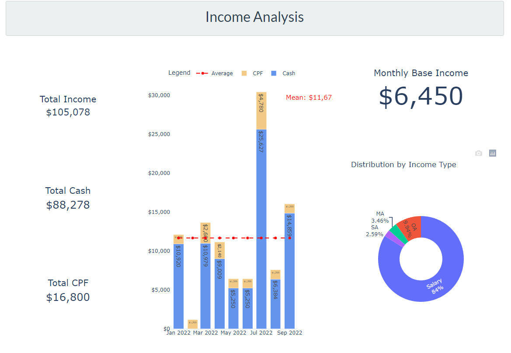

# Asset Tracker
Asset Tracker is a full-stack web app that helps to track monthly total asset values of an individual.

## Overview
Assets tracked in this project are mainly from the following 3 sources:
1. Cash (Bank account)
2. Investment (tracked with a separate web app [Trading Dashboard](https://github.com/Benlau93/trading-dashboard))
3. CPF (Singapore Mandatory Social Security Savings Scheme)

### Data Source
1. Cash  
Current Cash flow is captured through monthly upload of bank e-statement. Using python PDF reader, e-statement are broken down into their respective transaction and important transactions such as monthly income and balance amount are captured and stored into the database.

2. Investment  
API calls are made to [Trading Dashboard](https://github.com/Benlau93/trading-dashboard) to extract monthly investment value.

3. CPF  
Similar to Cash saving, monthly CPF e-statement are uploaded and transactions are extracted and stored.

## Technology Used
1. Web Frontend - Dash Plotly (Python)
2. Backend API - Django Restful API (Python)
3. Database - Sqlite3 (RDBMS)

## Demo

## Enhancement/Features Added

### Income Tracker
With the monthly income data extracted from bank e-statement, we can easily track and analyse income trends

### Personal Tax Analysis and Projection
Further tapping on income data, we can project payable personal tax for the current year

